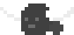

# KodlandGame
El proyecto incluye su entorno virtual en Python con las dependencias utilizadas para su desarrollo. Por lo tanto, solo es necesario descargarlo y activar el entorno para su ejecución.

Contiene una carpeta public que incluye las imágenes en formato PNG del mapa y de los personajes del juego. El proyecto implementa funciones personalizadas para renderizar y animar a los personajes, así como para gestionar las colisiones entre los rectángulos de los objetos.

En el bucle principal se verifican dos acciones clave:

La tecla espacio, con la cual se inicia el juego.

La tecla F, que permite atacar a los enemigos lanzando hachas.

Inicialmente, el jugador cuenta con 10 hachas. A medida que avanza el juego, podrá usarlas y conseguir más. Durante la partida, el jugador tiene 3 vidas; por cada colisión se pierde una vida hasta que se agoten y el juego finalice.

